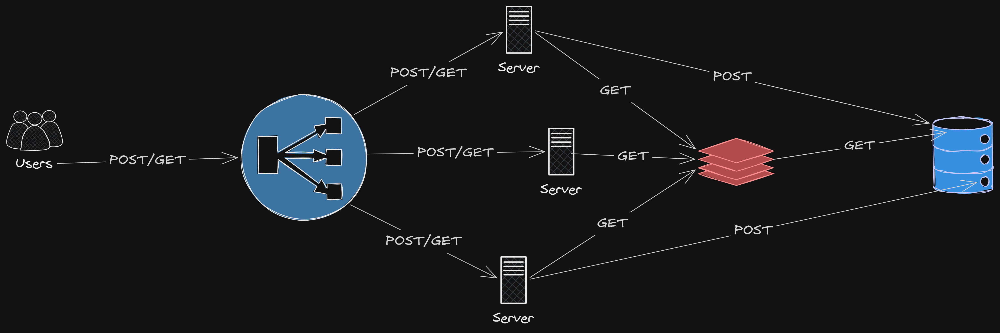

# Short Link

Short Link is a URL shortener service built in Go. It converts long URLs into short, redirectable identifiers and stores them with persistence, caching, monitoring and observability in mind.

The project is designed to be easy to run locally, easy to deploy in Kubernetes and suitable as a foundation for real-world URL shortening services.

## Why this project exists

The main goal of the service is to simplify long URLs and enable:

- creation of short links from any valid URL;
- safe and direct redirection to the original destination;
- persistence in a relational database;
- reduced latency through Redis caching;
- operational visibility through Prometheus and Grafana;
- Kubernetes deployment with support for autoscaling and monitoring.

## Key features

- HTTP API implemented with Gin;
- link persistence in PostgreSQL;
- read-through caching in Redis;
- short ID generation using NanoID;
- redirect endpoint for original URL retrieval;
- metrics exposed on `/metrics`;
- local Kubernetes deployment with Kind;
- ServiceMonitor integration for Prometheus and Grafana;
- clean layered structure across handlers, use cases, repository and entities.

## Architecture

The diagram below shows the overall architecture of the system and how clients, the API, Redis and PostgreSQL interact.



## Tech stack

- Go
- Gin
- PostgreSQL
- Redis
- Prometheus
- Grafana
- Kubernetes / Kind
- Docker

## How it works

The main flow is:

1. A client sends a POST request to the API with the original URL;
2. the application generates a short identifier;
3. the record is persisted in PostgreSQL;
4. the user can access the URL using the short code;
5. the service redirects the request to the original destination;
6. Redis may be used to improve read performance and reduce database pressure.

## Core endpoints

- `POST /api/v1/links` — create a short link;
- `GET /r/:hash` — redirect to the original URL;
- `GET /health` — health check endpoint;
- `GET /metrics` — exposes Prometheus metrics.

## Project structure

- `cmd/server` — application entry point;
- `internal/` — bootstrap, handlers, use cases, repositories, entities and observability;
- `pkg/` — shared utilities, logger, database and metrics;
- `sql/` — database migrations and queries;
- `k8s/` — Kubernetes manifests;
- `docs/` — project documentation and architecture drawings.

## Requirements

- Docker
- kubectl
- kind
- Helm (for the Prometheus Operator stack)
- Go (optional, for local development)

## Setup and running

For detailed installation, local Kubernetes deployment and troubleshooting instructions, see:

- [SETUP.md](SETUP.md)

## Local Kubernetes deployment

This project includes manifests to run the service in a local Kind cluster with:

- dedicated namespace;
- PostgreSQL;
- Redis;
- API with multiple replicas;
- HPA;
- Gateway API;
- Prometheus Operator and Grafana;

The full setup guide is available in [SETUP.md](SETUP.md).

## Observability

The application exposes standard metrics for Prometheus monitoring. The project also includes a ServiceMonitor to enable integration with the Kubernetes monitoring stack.

## Cleanup

To remove the local cluster environment:

```bash
kubectl delete namespace short-link
kind delete cluster --name short-link
```

## Contribution

Contributions are welcome. This project aims to remain simple, readable and easy to extend with future features such as:

- authentication and authorization;
- rate limiting;
- click analytics;
- link expiration;
- custom aliases and multi-domain support.
